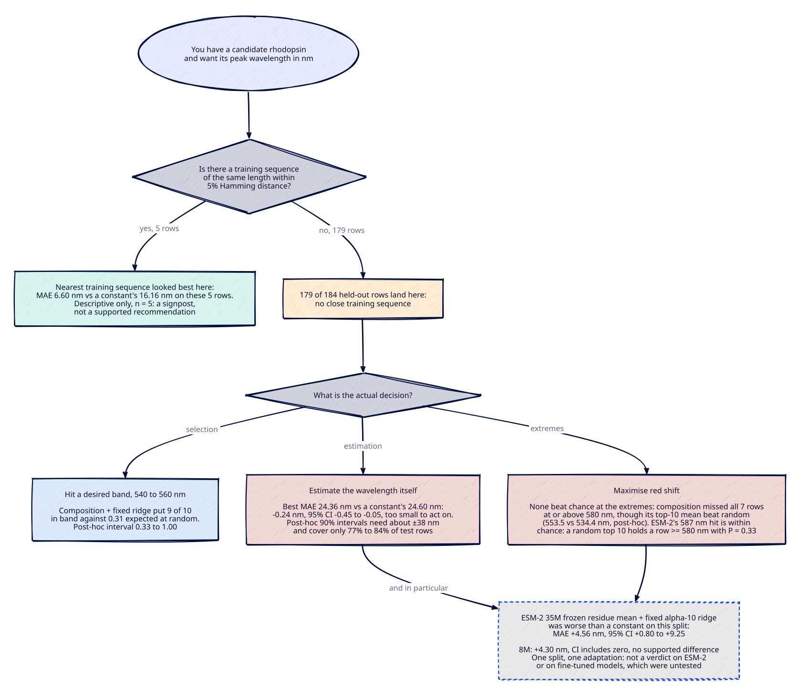
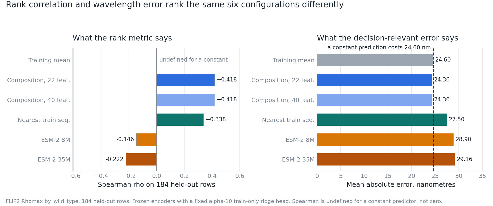
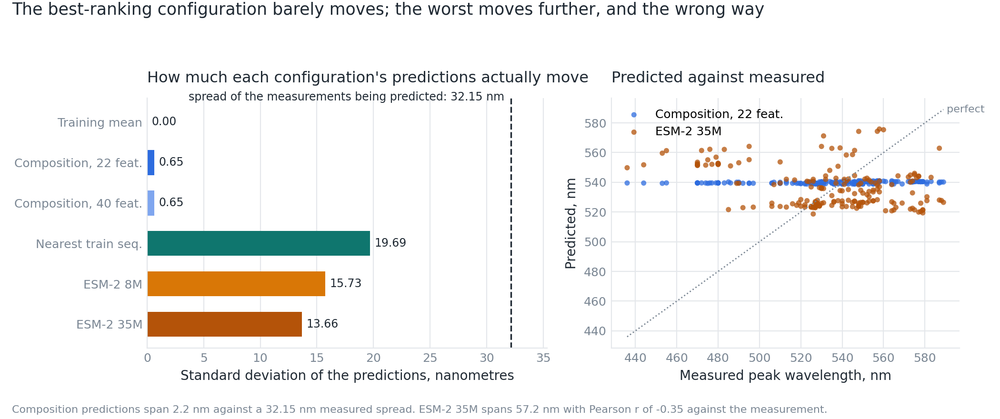
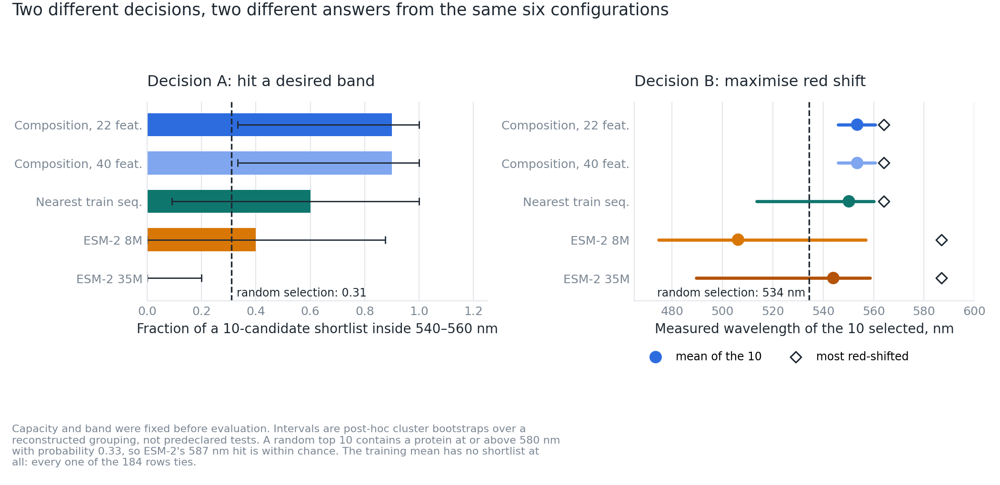
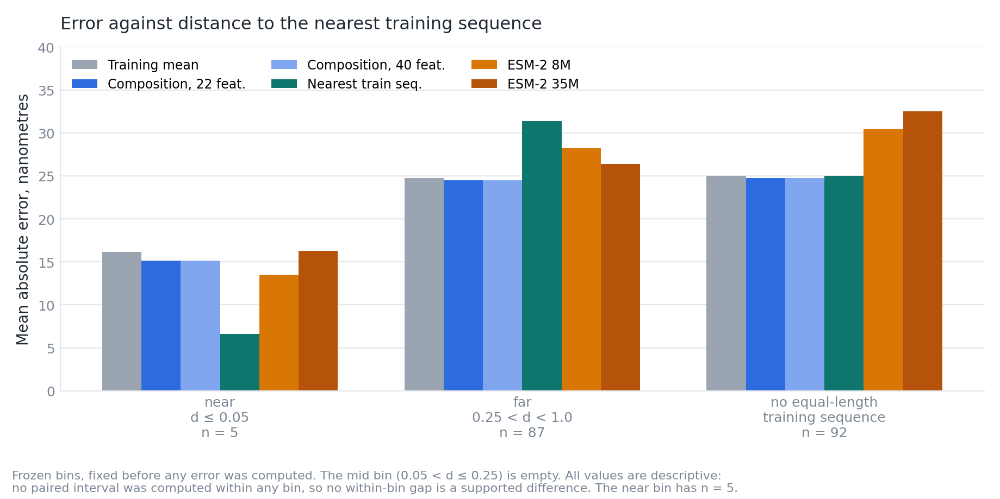

You have a rhodopsin candidate, you want its peak absorption wavelength in nanometres, and it sits in a wild-type background your training set does not contain. Six configurations were run on the FLIP2 Rhomax `by_wild_type` split and scored on the same 184 held-out rows: a constant training-mean prediction, two archived amino-acid-composition controls with a fixed alpha-10 ridge, frozen ESM-2 8M and 35M residue-mean embeddings with the same head, and a nearest-training-sequence lookup.

The endpoint is peak absorption wavelength in nanometres and nothing else. No number below says anything about activation efficiency, expression level, photostability, ion transport or cellular function.

The best rank correlation belongs to a composition control at +0.418 Spearman. It beats the constant by 0.24 nm of mean absolute error, 24.36 nm against 24.60 nm, on a test set whose measured standard deviation is 32.15 nm. The two numbers disagree because the probe's entire predicted range is 2.2 nm wide: it is a constant with a wobble, and the wobble points the right way. Meanwhile the two worst configurations on every aggregate metric, frozen ESM-2 8M and 35M, both surfaced a 587 nm protein in their red-shift shortlists, and that hit sits inside chance.

So "which model is best" has one answer per decision, and the decisions do not agree.

## The decision table

| Your decision | What the panel supports | Comparator for this row | The measured difference | What the uncertainty supports |
| --- | --- | --- | --- | --- |
| Estimate a candidate's wavelength in nm | Composition plus the fixed ridge, or the constant itself | Constant training-mean prediction | MAE 24.36 nm against 24.60 nm | −0.24 nm, 95% paired cluster bootstrap [−0.45, −0.05]: direction resolved, below the 2 nm reporting threshold |
| Shortlist 10 candidates for a 540 to 560 nm band | Composition plus the fixed ridge | Uniform random selection of 10 rows, precision 0.3098. The constant has no shortlist, so there is no comparison to make | 9 of 10 in band | Post-hoc 95% interval on precision [0.33, 1.00]. Above random, with a lower bound close to it, and no shortlist test was predeclared |
| Shortlist 10 candidates to maximise red shift | Composition's shortlist averages above random. Nothing in the panel found the extremes better than chance | Uniform random selection, expected top-ten mean 534.43 nm. The constant has no shortlist | Top-ten mean 553.50 nm, best pick 564 nm, against an oracle top-ten mean of 583.30 nm | Post-hoc 95% interval [546.0, 560.6] excludes 534.43 nm, but it is post-hoc, so not a supported difference. None of the seven rows at or above 580 nm was found |
| Score a candidate that has an equal-length training sequence within 0.05 Hamming distance | Nearest-training-sequence lookup | Constant training-mean prediction, 16.16 nm on the same 5 rows | MAE 6.60 nm | None. No paired interval was computed in any bin, and n = 5, so this is descriptive |
| Avoid | Frozen ESM-2 35M residue mean into the same fixed head | Constant training-mean prediction | ΔMAE +4.56 nm, worse | [+0.80, +9.25]: the only supported difference in the panel |
| Anything other than peak absorption wavelength in nm | Untested here, which is not the same as measured failure | Not applicable | Not applicable | Not applicable |

*Table 1. Recommendations for one population only: the 184 held-out rows of the FLIP2 Rhomax `by_wild_type` split, 92 of which have no training sequence even of the same length. Each row names its own comparator, because the estimation rows compare against a constant training-mean prediction while the shortlist rows compare against uniform random selection at the same capacity. The adaptation is a frozen encoder with a fixed alpha-10 ridge head and target scaling fitted on the 584 train rows only, with no hyperparameter search. Intervals are 95% paired cluster bootstrap over 37 reconstructed background groups, which are a declared reconstruction and not an archive label; shortlist intervals are post-hoc and were not predeclared. Endpoint: peak absorption wavelength in nm. Measurements originate with Inoue et al. 2021, CC-BY 4.0, reaching this workspace through FLIP2.[^1][^2]*

That is the answer. The rest is how it was measured, and where it breaks.



*Figure 1. The same panel read as a decision path. The estimation and near-match leaves compare against a constant training-mean prediction; the two shortlist leaves compare against uniform random selection at capacity 10, because a constant defines no shortlist. Population: the 184 held-out rows of the FLIP2 Rhomax `by_wild_type` split. Adaptation: frozen encoder, fixed alpha-10 train-only ridge head, no tuning. Supported uncertainty: paired cluster bootstrap over 37 reconstructed background groups with a 2 nm reporting threshold, except the 5-row near leaf, where no interval was computed and the number is descriptive, and the shortlist leaves, whose intervals are post-hoc. Measurements originate with Inoue et al. 2021, CC-BY 4.0, via FLIP2.[^1][^2]*

## What was run, and why a constant is a serious opponent

The archive is FLIP2 Rhomax, `by_wild_type` split, Zenodo record 18433203 version 3, CC-BY 4.0.[^3] Verified from the bytes rather than from the paper: 884 rows in 584 train, 116 validation and 184 test; four columns, `sequence`, `target`, `set` and `validation`; targets in nanometres from 436 to 622 across 144 distinct values; lengths 227 to 365 residues over exactly the 20 standard amino acids; and zero sequence overlap across all three split pairs. The decompressed CSV has sha256 `8e78f6a16cd5298131dca83130d4b94cc0ab4ae9c699460880441c19a65f656f`, checked before anything is scored.

The split is hard in one specific way. Random splits of protein data mislead, because sequences are correlated by evolutionary history,[^4] so FLIP2 trains on the five most common wild types and tests on 36 others.[^2] It reports split means of 539.7, 531.7 and 534.4 nm; the companion recomputes 539.73, 531.73 and 534.43 nm from the bytes, an independent check on the parsing.

Those means being so close shapes everything else. The test median is 539.5 nm, the constant that minimises test mean absolute error, and the training mean of 539.7329 nm sits within 0.25 nm of it. A constant fitted on train is therefore within a quarter of a nanometre of the best possible constant on test, and any model has to earn its error reduction against that.

The bytes show one more thing. Six sequences appear twice, all inside train, and two pairs disagree: `37b98f5e1e0a` carries 525 and 524 nm, `bb35eb34d803` carries 498 and 517 nm. Whether those are repeated assays or repackaging artefacts is not stated upstream and was not established here, so 19 nm is a caution, not an assay precision estimate. That disagreement for an identical sequence is why the reporting threshold below is 2 nm rather than something tighter.

Those twelve-character identifiers are `sha256(sequence)[:12]`, computed here. The archive publishes no identifiers, names or assay conditions, so they are local handles rather than accessions and they will not resolve anywhere.

The adaptation is deliberately frozen. Ridge alpha is 10 with no feature scaling, exactly as archived, a tenfold stronger penalty than the scikit-learn default,[^5] and target scaling uses train rows only. The ESM-2 checkpoints are `esm2_t6_8M_UR50D` and `esm2_t12_35M_UR50D`, read at layers 6 and 12 and pooled by mean over residues.[^6] Five of the six configurations are reimplementations of a historical panel and all five reproduce to absolute difference 0.0 at tolerance 1e-9 in a fresh Python 3.11.13 environment.

## Rank correlation and nanometres rank the panel differently

| Configuration | Spearman | NDCG | MAE nm | RMSE nm | ΔMAE nm | 95% interval | Verdict |
| --- | ---: | ---: | ---: | ---: | ---: | --- | --- |
| Composition, 22 features | +0.418 | 0.9548 | 24.36 | 32.29 | −0.24 | [−0.45, −0.05] | direction resolved, below the 2 nm threshold |
| Composition, 40 features | +0.418 | 0.9548 | 24.36 | 32.29 | −0.24 | [−0.45, −0.05] | direction resolved, below the 2 nm threshold |
| Training mean | undefined | 0.9207 | 24.60 | 32.50 | baseline | not applicable | comparator |
| Nearest training sequence | +0.3385 | 0.9453 | 27.50 | 34.73 | +2.90 | [−7.86, +12.21] | no supported difference |
| ESM-2 8M, layer 6, residue mean | −0.146 | 0.8965 | 28.90 | 41.23 | +4.30 | [−0.58, +11.26] | no supported difference |
| ESM-2 35M, layer 12, residue mean | −0.222 | 0.9073 | 29.16 | 39.04 | +4.56 | [+0.80, +9.25] | supported: worse than a constant |

*Table 2. Six configurations on the 184 held-out rows of the FLIP2 Rhomax `by_wild_type` split, each with a frozen representation and a fixed alpha-10 train-only ridge head. Comparator for the error columns is the constant training-mean prediction; differences are candidate minus comparator, so positive is worse. Spearman is undefined for a constant predictor, because all 184 predictions tie; it is not zero. The rank metrics for the nearest-sequence control are new here and absent from the archived panel, which reported only the five historical configurations. Uncertainty: paired cluster bootstrap, 10,000 draws, seed 20261001, resampling 37 reconstructed background groups. The Spearman and NDCG columns carry no interval and must not be read as though they did.*

Spearman and NDCG were reported upstream; nanometres were not. Every RMSE here is at or above the measured test standard deviation of 32.15 nm, so none of these configurations explains variance in any useful sense, and the best mean absolute error in the panel is 0.24 nm better than predicting one number for every protein.

Three verdicts sit in that last column and they stay apart for the rest of this article, because collapsing them is the main way a table like this gets misread. A supported difference has an interval excluding zero and a point estimate above the 2 nm threshold. A resolved direction too small to act on has the same interval property but a point estimate below it. No supported difference means the interval includes zero, which is a statement about what this split can resolve, not a claim that two configurations perform the same. Untested is a fourth thing: nothing here speaks to a fine-tuned model, a larger checkpoint, a structure-aware model or any background outside this archive, so none of those is known to fail.

The grouping caveat travels with every interval here. The archive publishes no background identity despite the split being named `by_wild_type`, so the resampling units were reconstructed from sequence length and Hamming distance under a rule fixed before any error was computed. There are 37 such groups, 22 of them singletons, the largest holding 30 rows, with about six carrying most of the weight. All 37 are used as resampling units, singletons included, and none are dropped: the group count is not a count of informative groups. Resampling whole clusters rather than rows is the standard procedure for grouped data, and the choice of resampling level is not cosmetic.[^7]



*Figure 2. The same six configurations ordered by rank correlation and by error in nanometres. Comparator: the constant training-mean prediction, drawn as the reference line at 24.60 nm on the error axis, with no defined Spearman. Population: the 184 held-out rows of the FLIP2 Rhomax `by_wild_type` split. Adaptation: frozen encoder, fixed alpha-10 train-only ridge head, no tuning. Lower is better on error, higher on Spearman. Supported uncertainty: only ESM-2 35M's error difference excludes zero and exceeds the 2 nm threshold, +4.56 nm [+0.80, +9.25] under the paired cluster bootstrap over 37 reconstructed groups; nothing in the Spearman panel carries an interval. Plotted from `runs/results/panel-receipt.json`; measurements originate with Inoue et al. 2021, CC-BY 4.0, via FLIP2.[^1][^2]*

### NDCG needs a scale before it means anything

All six NDCG values sit between 0.8965 and 0.9548, with the constant predictor in the middle at 0.9207, which invites the reading that everything here ranks competently. The scale was therefore measured rather than argued. On these exact 184 targets, with the same relevance transform, full ranking and tie rule as the historical metric, a perfect ranking scores 1.0000 and the worst possible ranking, exactly reversed, scores 0.8131. Ten thousand random orderings average 0.9207, with a 95% range of 0.8975 to 0.9403. That reference is post-hoc and single-split: a scale, not a test.

Read the panel against that scale and NDCG does order these configurations. Composition at 0.9548 is above every one of the 10,000 random draws, the nearest-sequence control at 0.9453 is above the 97.5th percentile, ESM-2 35M at 0.9073 falls inside the random range, and ESM-2 8M at 0.8965 is just below its 2.5th percentile. The constant's 0.9207 is exactly the random-ordering mean, which is what scikit-learn's default tie averaging gives when every prediction is identical.[^8] Wang et al. prove that log-discount NDCG converges to 1 as list length goes to infinity for any ranking function, and that it keeps consistent distinguishability all the same.[^9]

What the measured range changes is how an absolute value reads. The achievable band on this list is 0.81 to 1.0, not 0 to 1, so 0.92 means "about what a random ordering gets" rather than "most of the way to perfect", and small gaps inside that band are hard to interpret. NDCG also measures ordering, not wavelength error, and the decision turns on nanometres. One detail is worth keeping straight: NDCG ties are averaged, while shortlist ties are broken by stable row order. Two tie rules for two different jobs.

## Why the best rank correlation buys 0.24 nanometres

| Configuration | Prediction sd nm | Span nm | sd as % of measured | Pearson r |
| --- | ---: | ---: | ---: | ---: |
| Training mean | 0.00 | 0.0 | 0% | undefined |
| Composition, 22 or 40 | 0.65 | 2.2 | 2.0% | +0.3621 |
| ESM-2 35M | 13.66 | 57.2 | 42.5% | −0.3488 |
| ESM-2 8M | 15.73 | 54.7 | 48.9% | −0.3120 |
| Nearest training sequence | 19.69 | 75.0 | 61.2% | +0.2550 |

*Table 3. Spread of predictions against the 32.15 nm measured spread of the 184 held-out rows of the FLIP2 Rhomax `by_wild_type` split, under a frozen encoder with a fixed alpha-10 train-only ridge head. Comparator is the constant training-mean prediction, whose spread is zero by construction and whose Pearson r is therefore undefined. These are descriptive statistics of the predictions and carry no interval; the supported uncertainty on the error differences they produce is in Table 2. Receipt: `runs/results/diagnostics.json`.*

The composition probe's wobble is why +0.418 Spearman translates into 0.24 nm: the ordering is monotone enough to be worth something, while the magnitudes are almost all shrinkage. ESM-2 produces real variation, 42% to 49% of the measured spread, pointing the wrong way.



*Figure 3. Why a rank correlation of +0.418 is worth 0.24 nm. Comparator: the constant training-mean prediction, which would be perfectly flat at 539.73 nm. Population: the 184 held-out rows of the FLIP2 Rhomax `by_wild_type` split. Adaptation: frozen encoder, residue-mean pooling, fixed alpha-10 train-only ridge head. Supported uncertainty: none in this figure, which is descriptive; the paired cluster-bootstrap intervals on the resulting error differences are in Table 2, where composition is −0.24 nm [−0.45, −0.05] and ESM-2 35M is +4.56 nm [+0.80, +9.25]. Plotted from `runs/results/diagnostics.json`; measurements originate with Inoue et al. 2021, CC-BY 4.0, via FLIP2.[^1][^2]*

Part of this is an artefact of the archived protocol, not a result about model families. Alpha is fixed at 10 with no feature scaling, so the same nominal penalty is not the same shrinkage. Total feature variance divided by alpha is 0.00105706 for the 22-feature composition vector against 0.0817550 for ESM-2 35M, a ratio of about 77; for the 40-feature vector it is 0.00034495 against the same 0.0817550, about 237. The panel does not hold regularisation constant across representations, which is a limitation of the comparison.

The two "distinct" archived composition controls are also barely distinct. Twenty of the 40-feature vector's columns are reserved for a second colon-separated component Rhomax does not have, so they are identically zero, and the 22-feature vector adds only log1p(length). That term moves Spearman by 0.0002. They are one control reported twice.

## Three decisions, three different answers

Capacity was fixed at 10 and both criteria were fixed before evaluation. Decision A is hitting a band, 540 to 560 nm, ranking by distance from 550 nm.

| Configuration | In band | Precision | Mean deviation from 550 nm | Post-hoc 95% interval on precision |
| --- | ---: | ---: | ---: | --- |
| Composition, 22 or 40 | 9/10 | 0.90 | 6.30 nm | [0.33, 1.00] |
| Nearest training sequence | 6/10 | 0.60 | 17.40 nm | [0.09, 1.00] |
| ESM-2 8M | 4/10 | 0.40 | 23.60 nm | [0.00, 0.88] |
| ESM-2 35M | 0/10 | 0.00 | 69.80 nm | [0.00, 0.20] |
| Training mean | no shortlist | not applicable | not applicable | not applicable |
| Uniform random, analytic | not applicable | 0.3098 | 26.31 nm | not applicable |

*Table 4. Decision A at capacity 10 on the 184 held-out rows of the FLIP2 Rhomax `by_wild_type` split, frozen encoder with a fixed alpha-10 train-only ridge head. Comparator: uniform random selection of 10 rows. In-band prevalence is 57 of 184, so 0.3098 is the random expectation. The constant predictor has no shortlist, because a precision computed on a row-order list would describe the file rather than the model. The intervals are post-hoc and were not predeclared; they are wide because resampling reconstructed groups changes which backgrounds are present at all. Receipt: `runs/results/exploratory-analysis.json`.*

Two readings sit together and both are honest. Composition's 9 of 10 is well above the 0.3098 random expectation, and it is sorting on a 2.2 nm signal, which is why the post-hoc interval reaches down to 0.33. The clearest post-hoc separation is ESM-2 35M at 0 of 10, upper bound 0.20, below random here; like every shortlist interval it is post-hoc, not a supported difference.

Decision B is maximising red shift, ranking by prediction descending.

| Configuration | Mean of top 10 nm | Max of top 10 nm | Post-hoc 95% interval on the mean |
| --- | ---: | ---: | --- |
| Oracle, best possible top 10 | 583.30 | 589 | not applicable |
| Composition, 22 or 40 | 553.50 | 564 | [546.0, 560.6] |
| Nearest training sequence | 550.20 | 564 | [513.6, 560.0] |
| ESM-2 35M | 544.00 | 587 | [489.5, 558.6] |
| Uniform random, analytic | 534.43 | not applicable | not applicable |
| ESM-2 8M | 506.20 | 587 | [474.7, 556.8] |

*Table 5. Decision B at capacity 10 on the same 184 held-out rows and the same frozen alpha-10 train-only adaptation. Comparator: uniform random selection of 10 rows, whose expected top-ten mean is 534.43 nm computed analytically from the measured targets; the constant has no shortlist. The oracle row is the best achievable, not a model. Intervals are post-hoc and were not predeclared, so composition's [546.0, 560.6], which excludes the random expectation, is a post-hoc lift rather than a supported difference under this protocol. Receipt: `runs/results/exploratory-analysis.json`.*

That table needs both of its halves. Composition's shortlist averaged above random selection, 553.50 nm against 534.43 nm, and its post-hoc interval excludes that expectation, so nudging a shortlist's average towards the red is something this panel did. It also found none of the seven test rows at or above 580 nm: its best pick was 564 nm, against an oracle top-ten mean of 583.30 nm. For finding the extremes, nothing in this panel did better than chance.

Both ESM-2 red-shift shortlists contain `781ca2b1c04b`, 350 residues, measured at 587 nm, with no equal-length training sequence. ESM-2 8M ranked it first at a predicted 578.98 nm; 35M placed it ninth at 562.94 nm. That is not skill. Seven of the 184 test rows sit at or above 580 nm, so a random shortlist of 10 contains at least one with probability 0.3283; for 585 nm or above it is 0.2018. One hit at one-in-three odds is a coincidence, and the rest of that shortlist makes the point: ESM-2 8M ranks `5e4e5b44d203` fifth at a predicted 571.15 nm, and that row is the bluest protein in the split, at 436 nm.

A different protein makes the point hardest. `c37359b2e9ef`, measured at 589 nm, is the most red-shifted row in the test set, sits 0.799 from the nearest equal-length training sequence, and appeared in no shortlist from any configuration. The most red-shifted protein available was selected by nothing. Do not read 587 and 589 as the same row: `da9591a13be6` is a third row, a second at 587 nm, which nothing surfaced either.



*Figure 4. The same panel scored against two different objectives. Comparator in both: uniform random selection of 10 rows, 0.3098 precision for Decision A and an expected top-ten mean of 534.43 nm for Decision B; the constant has no shortlist under either. Population: the 184 held-out rows of the FLIP2 Rhomax `by_wild_type` split. Adaptation: frozen encoder, fixed alpha-10 train-only ridge head. Supported uncertainty: none. Every interval shown is post-hoc and not predeclared, including composition's [546.0, 560.6], which excludes the random expectation on Decision B without making that a supported difference. Decision B uses points rather than bars because its axis does not start at zero. Measurements originate with Inoue et al. 2021, CC-BY 4.0, via FLIP2.[^1][^2]*

## Failure modes: distance to the training set

Distance is length-gated normalised Hamming: equal length gives Hamming over length, unequal gives 1.0. It is crude because lengths differ by up to 138 residues and no alignment policy had been fixed. Bins were frozen before any error was computed.

| Bin | n | Meets the n ≥ 10 minimum | Target range nm | Nearest training sequence | ESM-2 8M | Composition | Training mean | ESM-2 35M |
| --- | ---: | --- | --- | ---: | ---: | ---: | ---: | ---: |
| near, d ≤ 0.05 | 5 | no | 523 to 560 | **6.60** | 13.49 | 15.11 | 16.16 | 16.29 |
| mid, 0.05 < d ≤ 0.25 | 0 | no, empty | not applicable | not applicable | not applicable | not applicable | not applicable | not applicable |
| far, 0.25 < d < 1.0 | 87 | yes | 470 to 589 | 31.38 | 28.18 | 24.47 | 24.71 | 26.38 |
| no equal-length training sequence | 92 | yes | 436 to 587 | 24.97 | 30.41 | 24.76 | 24.97 | 32.49 |

*Table 6. MAE in nm per frozen distance bin, 184 held-out rows of the FLIP2 Rhomax `by_wild_type` split, frozen encoder with a fixed alpha-10 train-only ridge head, comparator the constant training-mean column. Every per-bin value here is descriptive. No paired interval was computed inside any bin, including the 87-row and 92-row bins, so no between-configuration difference inside a bin is a supported difference anywhere in this article. The protocol's n ≥ 10 rule is a minimum size below which no claim may be made, not a licence to claim above it. The two composition variants are identical to two decimal places in every bin. Receipt: `runs/results/exploratory-analysis.json`.*

Only 5 of 184 test rows sit in the regime where a close equal-length homologue exists, and in exactly that regime the trivial lookup is far the best thing in the panel at 6.60 nm. With n = 5 and no interval that is a signpost rather than a difference claim, but it is the signpost worth following: look for a close equal-length relative before you train anything.

The `mid` bin is empty. There is no gradient of moderately similar backgrounds here: either a near-identical training sequence exists or nothing close does. Nothing in this panel was ever observed at intermediate distance, so that regime is untested. Untested is not measured failure, and it is also not reassurance.

The 92-row bin is the heart of the problem. Those rows have no training sequence even of the same length, and on all 92 the nearest-sequence control falls back to its documented default and emits exactly 539.732877 nm, the training mean to the digit. The two are therefore the same predictor on half the test set, which is why their MAE in that bin is identically 24.97 nm. On half the held-out rows the interpretable control has nothing to interpolate from. One detail matters for your own data: this bin is defined by the absence of a neighbour, not by a distance of 1.0. The largest equal-length nearest distance on test is 0.9375, so no row here is affected, but a sequence you supply could be.

Six held-out rows show what the bins hide.

| seq_id | csv_row | length | measured nm | d to nearest train | nearest train seq_id | nearest-seq pred nm | composition-22 pred nm | ESM-2 35M pred nm |
| --- | ---: | ---: | ---: | ---: | --- | ---: | ---: | ---: |
| `1126648311d3` | 187 | 280 | 523 | 0.0179 | `37b98f5e1e0a` | 525.0 | 538.81 | 527.60 |
| `78c26b0b585d` | 223 | 262 | 558 | 0.0038 | `18414205e448` | 551.0 | 540.82 | 575.86 |
| `1937f73b396e` | 224 | 262 | 557 | 0.0076 | `18414205e448` | 551.0 | 540.83 | 574.32 |
| `c28e8cbcbc78` | 225 | 262 | 560 | 0.0038 | `72fa783e9afa` | 575.0 | 540.78 | 575.38 |
| `848b6cf05e5c` | 226 | 262 | 548 | 0.0076 | `18414205e448` | 551.0 | 540.82 | 574.27 |
| `781ca2b1c04b` | 166 | 350 | 587 | 1.0000, no match | none | 539.73 | 539.56 | 562.94 |

*Table 7. Six of the 184 held-out rows of the FLIP2 Rhomax `by_wild_type` split, from `runs/results/test-predictions.json`, with the configuration named per prediction column; the frozen-encoder columns use the fixed alpha-10 train-only ridge head, and the comparator for every row is the constant training-mean prediction of 539.73 nm. The first five are the entire near bin. The last is the 587 nm row both ESM-2 shortlists surfaced; it has no equal-length training sequence, so the nearest-sequence control falls back to the training mean of 539.73 nm. These are illustrations of individual rows and carry no uncertainty: none may be generalised into a claim about a configuration. Identifiers are workspace-local `sha256(sequence)[:12]` digests, not accessions. Measurements originate with Inoue et al. 2021, CC-BY 4.0, via FLIP2.[^1][^2]*

The near bin also shows why the length-gated distance flatters nobody. Row `1126648311d3` has as its nearest training sequence `37b98f5e1e0a`, one of the two duplicated training sequences carrying disagreeing targets, 525 and 524 nm; the lookup returned 525.0 and the measurement is 523. The three rows nearest to `18414205e448` all got the same 551.0 prediction against measurements of 558, 557 and 548.



*Figure 5. Error by distance to the training set. Comparator: the constant training-mean prediction, plotted as its own series. Population: the 184 held-out rows of the FLIP2 Rhomax `by_wild_type` split, as 5 near rows, an empty mid bin, 87 far rows and 92 rows with no equal-length training sequence. Adaptation: frozen encoder, fixed alpha-10 train-only ridge head. Uncertainty: none; every value plotted is descriptive, no within-bin interval was computed, and the near bin holds 5 rows. Measurements originate with Inoue et al. 2021, CC-BY 4.0, via FLIP2.[^1][^2]*

There is a biological reason not to expect a composition or nearest-neighbour feature to carry this load. Blue- and green-absorbing proteorhodopsins share more than 78% of their residues while absorbing 35 nm apart at 490 and 525 nm, and most of that difference is attributable to a single residue at position 105 whose swap almost completely interconverts the two spectra.[^10] Colour tuning is also complex: in the crystal structures, water-containing hydrogen-bonding networks act as complex counterions to the protonated Schiff base.[^11] A composition vector throws away position entirely, and a Hamming distance over unaligned sequences of different lengths is barely a homology measure.

## What an interval costs

Half-widths were set at the 90th percentile of absolute residuals on the 116 validation rows the historical protocol never read, then applied to test. The probe is post-hoc and was not predeclared.

| Configuration | Half-width nm | Observed test coverage | Wilson 95% | Nominal |
| --- | ---: | ---: | --- | ---: |
| Training mean | 37.7 | 0.772 | [0.706, 0.826] | 0.90 |
| Composition, 22 or 40 | 38.1 | 0.783 | [0.718, 0.836] | 0.90 |
| Nearest training sequence | 41.7 | 0.788 | [0.723, 0.841] | 0.90 |
| ESM-2 35M | 43.4 | 0.766 | [0.700, 0.822] | 0.90 |
| ESM-2 8M | 47.5 | 0.837 | [0.777, 0.883] | 0.90 |

*Table 8. Post-hoc interval feasibility probe, not predeclared and not a calibration result, on the 184 held-out rows of the FLIP2 Rhomax `by_wild_type` split with a frozen encoder and a fixed alpha-10 train-only ridge head. Comparator is the constant training-mean prediction at 37.7 nm half-width and 0.772 coverage. Widths come from the 116 otherwise unused validation rows; coverage is observed on test. The Wilson interval excludes the nominal 0.90 for all six configurations. Receipt: `runs/results/exploratory-analysis.json`.*

Two things follow and nothing more. A 90% interval needs about 38 nm of half-width for the best configuration, which spans most of the useful range of this endpoint, and it still covers only about 78% of test rows, Wilson excluding 0.90 for all six. Split conformal and its relatives guarantee coverage under exchangeability,[^12] which is exactly what a by-wild-type transfer split is designed to break; repairing it needs explicit shift weighting or a nonexchangeable method.[^13] No calibration claim is made: checking coverage under background shift would need several independent held-out background sets, and the archive publishes no background labels.

## Measured cost

Across three complete runs on an Apple M4 with 16 GB, on CPU, batch size 4, 4 torch threads, torch seed 0, the whole panel took 49 to 52 s of wall time and 1.37 to 1.48 GB of peak RSS. In the run whose receipt ships with this article, ESM-2 35M encoding of all 884 sequences took 35.2 s and ESM-2 8M 13.2 s, against 0.004 s for the composition features and 0.0001 s for the constant. One machine, one batch size, so not a hardware-normalised benchmark. The accelerator does not help at this scale: on 40 sequences with ESM-2 8M, MPS took 2.22 s against CPU's 0.55 s.

So the cost framing is not that ESM-2 is expensive. Half a minute of encoding is nothing. The cost is the engineering time around it, and on this split that buys a configuration measurably worse than a constant.

## Reproduce it

The companion ships as two archives linked from this post: code ([rhomax-wavelength-panel-code.tar.gz](../downloads/rhomax-wavelength-panel-code.tar.gz), no data or weights) and run receipts with per-row predictions ([rhomax-wavelength-results.tar.gz](../downloads/rhomax-wavelength-results.tar.gz), no sequences or weights). Extract the code archive and work inside it. Setup needs Python 3.11 and about 160 MB of downloads.

```bash
cd companion
uv venv --python 3.11 .venv
VIRTUAL_ENV=.venv uv pip install -r requirements-locked.txt
VIRTUAL_ENV=.venv uv pip install -e . --no-deps
mkdir -p cache

curl -L -o cache/by_wild_type.csv.gz \
  "https://zenodo.org/api/records/18433203/files/rhomax/by_wild_type.csv.gz/content"
curl -L -o cache/esm2_t6_8M_UR50D.pt \
  https://dl.fbaipublicfiles.com/fair-esm/models/esm2_t6_8M_UR50D.pt
curl -L -o cache/esm2_t12_35M_UR50D.pt \
  https://dl.fbaipublicfiles.com/fair-esm/models/esm2_t12_35M_UR50D.pt
```

Every input is hash-checked, and the run refuses to proceed on a mismatch rather than quietly scoring a different split. The decompressed CSV must hash to `8e78f6a16cd5298131dca83130d4b94cc0ab4ae9c699460880441c19a65f656f`. That hash defines the dataset, not the archive hash, because the FLIP mirror serves the same CSV inside different gzip framing.

Then the panel, the analysis and the diagnostics. The `--skip-esm` line reproduces three of the five archived configurations with no weights:

```bash
rhomax-panel --cache ./cache verify
rhomax-panel --cache ./cache panel --output ./results --skip-esm
rhomax-panel --cache ./cache panel --output ./results
rhomax-panel --cache ./cache analyse --output ./results --baseline training-mean
python scripts/diagnostics.py --cache ./cache --results ./results --output ./results/diagnostics.json
python scripts/device_agreement.py --cache ./cache --model esm2_t6_8M_UR50D
python -m pytest tests/ -q
```

Expect 584 train, 116 validation and 184 test rows; Spearman +0.41798958 for `composition-22`, +0.41818225 for `composition-40`, −0.14635068 for `esm2-8m` and −0.22175950 for `esm2-35m`; and NDCG 0.92066675 for `training-mean`. `panel` exits non-zero if any configuration fails to match its archived Spearman and NDCG at 1e-9, so silent drift cannot pass. The suite is 44 tests, of which 43 run and 1 skips when no completed panel run is present, aimed at the ways this code could produce a plausible but wrong wavelength: a substituted data file, wrong split counts, a leaked label, a constant scored as though it had a rank correlation, NDCG tie handling, and a tuned ridge masquerading as a historical configuration.

Scoring your own candidates is unlabelled inference, not held-out evaluation, and the CLI keeps these apart:

```bash
python scripts/make_example_fasta.py --cache ./cache --output ./example.fasta
rhomax-panel --cache ./cache predict ./example.fasta --configuration composition-22
```

Input rules are enforced: the 20 standard amino acids only, and 1 to 1022 residues with longer sequences rejected and never cropped. The output gives, per sequence, the predicted wavelength in nm, whether it falls outside the training range, and the distance to the nearest training sequence. Read that last column against Table 6 before you believe the first.

## What this comparison does not establish

It is one split, one pooling, one frozen adaptation and one fixed head. It is not evidence about ESM-2 in general, nor about fine-tuned protein language models, which were not run. Frozen embeddings do beat one-hot baselines elsewhere: on catalytic turnover across adenylate kinase orthologs in a low-data regime, nonlinear probing of frozen embeddings outperformed one-hot, and learnable aggregation was the most performant pooling, though only marginally ahead of common fixed pooling.[^14] A fixed residue mean into a linear ridge is neither of those choices. That same study found earlier layers no better than the final one, so the final-layer read used here is not an obvious culprit, and nothing in it establishes that a different pooling would have rescued these embeddings on this task.

Untested transfer is not measured failure. No fine-tuned model, no larger model, no structure-aware model and no model on a background outside this archive was run, and none of those is therefore known to fail. ESM-2 runs from 8 million to 15 billion parameters, with capability described by its authors as emerging with scale;[^15] these are its two smallest checkpoints, and the 35M was chosen after the 8M result was known, so that pair is exploratory rather than a preregistered scale experiment.

Other things not established. The reconstructed grouping is not the archive's, so repeated held-out-background cross-validation was not attempted. Calibration under background shift is not claimed. An aligned one-hot ridge was not attempted, because no reproducible alignment and insertion policy was fixed. FLIP2's published baselines are not comparators here: its Ridge one-hot scores 0.327 Spearman with NDCG 0.939,[^2] but this workspace's record of the pinned upstream baseline code shows it scales targets on train plus validation rows while every configuration here scales on train alone, so treat 0.327 as context rather than a score to beat. Its model tables also conflict: Table A17 lists CARP-640M supervised at 0.379 Spearman as the best baseline on this split, while Table A15 reports it at 0.072 ± 0.244.[^2] Whether any of these proteins sit in ESM-2's UniRef pretraining corpus is unreported upstream and was not determined here. In one study of melting-point prediction, pretraining leakage consistently inflated measured performance on the original FLIP split relative to a pretraining-aware split; nothing comparable has been measured for Rhomax.[^16] No human review of this panel has taken place, and automated review is not human review.

## What would change the recommendation

Three results would move Table 1.

A learnable aggregation over the same frozen embeddings, under the same train-only protocol and cluster bootstrap, is the first thing to run: it tests whether pooling or representation failed here.[^14] The encoding pass costs about 35 s on the CPU measured above, and beating the constant by more than 2 nm with an interval excluding zero would rewrite the table's first row.

An alignment-based representation, with its policy fixed before any error is computed, would address the objection that a composition vector cannot see a single switch residue: mutations at position 105 almost completely interconvert the blue- and green-absorbing proteorhodopsin spectra.[^10] One-hot encodings over aligned positions underlie the VPOD opsin wavelength models, down to 6.56 nm mean absolute error, albeit with far more and more diverse training data than five backgrounds.[^17] On this split that approach is untested, not refuted.

Published background labels would change the most. With real wild-type identifiers the reconstructed grouping disappears, repeated held-out-background cross-validation becomes possible, and the intervals in Table 2 could narrow enough to separate what this analysis leaves unresolved.

Until then the defensible position is narrow and usable. Against a constant training-mean prediction, on the 184 held-out rows of the FLIP2 Rhomax `by_wild_type` split, with a frozen encoder and a fixed alpha-10 train-only ridge head: the composition probe is better by 0.24 nm, 95% paired cluster bootstrap over 37 reconstructed groups [−0.45, −0.05], below the 2 nm threshold anyone would act on, and frozen ESM-2 35M residue-mean embeddings are worse, +4.56 nm [+0.80, +9.25]. If a close equal-length relative exists, look it up: on the 5 such rows the lookup scored 6.60 nm against the constant's 16.16 nm, descriptive only, with no interval. For a point estimate, quote the constant's post-hoc half-width of 37.7 nm, which covered 77.2% of test rows against a nominal 0.90, Wilson [0.706, 0.826], and decline to call it calibrated. For a 540 to 560 nm band, shortlist with the composition probe, which put 9 of 10 in band against 0.3098 for uniform random selection, and read its post-hoc interval [0.33, 1.00] first. None of this speaks to activation efficiency, expression, photostability, ion transport or cellular function.

The field-level context agrees. FLIP2 reports that fine-tuned protein language models were best on only 4 of 16 splits and do not consistently improve on simpler methods for wild-type and position splits,[^2] and a 2026 preprint reports that one-hot encoding matched or outperformed the best protein language model in nearly all the settings it tested.[^18] That is not a reason to stop using these models. It is a reason to put a constant predictor in every comparison table, and to report error in the units the experiment is measured in.

## References

[^1]: Inoue, K., Karasuyama, M., Nakamura, R., Konno, M., Yamada, D., Mannen, K., Nagata, T., Inatsu, Y., Yawo, H., Yura, K., Béjà, O., Kandori, H., Takeuchi, I. "Exploration of natural red-shifted rhodopsins using a machine learning-based Bayesian experimental design." *Communications Biology* 4, 362 (2021). DOI 10.1038/s42003-021-01878-9. <https://www.nature.com/articles/s42003-021-01878-9>. CC-BY 4.0. The origin of every wavelength measurement used here, reaching this workspace through the FLIP2 Rhomax archive. The paper publishes no full downloadable measurement table (data available from the corresponding authors on reasonable request), so FLIP2's redistribution is the practical access route. An Author Correction was published 30 April 2021.

[^2]: Didi, K., Alamdari, S., Lu, A. X., Wittmann, B., Johnston, K. E., Amini, A. P., Madani, A., Czeneszew, M., Dallago, C., Yang, K. K. "FLIP2: Expanding Protein Fitness Landscape Benchmarks for Real-World Machine Learning Applications." ICML 2026 (oral). Camera-ready PDF: <https://flip.protein.properties/assets/FLIP_manuscipt.pdf>. CC-BY 4.0 preprint version: bioRxiv 10.64898/2026.02.23.707496v4, posted 29 May 2026, <https://www.biorxiv.org/content/10.64898/2026.02.23.707496v4.full.pdf>. Source of the split design (train on the five most common wild types, test on 36 others), the 539.7 / 531.7 / 534.4 nm split means, the Spearman and NDCG reporting choice, the published Rhomax `by_wild_type` baselines including Ridge one-hot at 0.327 Spearman and 0.939 NDCG, and the fine-tuning conclusions. The CARP-640M conflict noted above is between its Table A17 and its Table A15.

[^3]: Zenodo record 18433203, version 3, published 30 January 2026. DOI 10.5281/zenodo.18433203. <https://zenodo.org/records/18433203>. CC-BY 4.0. Confirms the file path `rhomax/by_wild_type.csv.gz` and its md5 `286781669d083104cc399ae8a561afc5`. **Not retrieved:** the archive's own `rhomax/README.md` returned HTTP 403 (traffic restriction) on repeated attempts, so no text from it is quoted here and the dataset description comes from the manuscripts and the landing page.

[^4]: Dallago, C., Mou, J., Johnston, K. E., Wittmann, B. J., Bhattacharya, N., Goldman, S., Madani, A., Yang, K. K. "FLIP: Benchmark tasks in fitness landscape inference for proteins." bioRxiv 2021.11.09.467890v2 (2021). CC-BY 4.0. <https://www.biorxiv.org/content/10.1101/2021.11.09.467890v2.full.pdf>. bioRxiv preprint.

[^5]: scikit-learn developers. `sklearn.linear_model.Ridge` documentation. BSD licence. <https://scikit-learn.org/stable/modules/generated/sklearn.linear_model.Ridge.html>. Retrieved 1 October 2026. Objective `||y − Xw||²₂ + alpha * ||w||²₂`, with default alpha 1.0.

[^6]: facebookresearch/esm repository README, `main` revision. MIT licence. <https://raw.githubusercontent.com/facebookresearch/esm/main/README.md>. Retrieved 1 October 2026. The authoritative checkpoint table: `esm2_t6_8M_UR50D` is 6 layers, 8M parameters, UR50/D 2021_04, embedding dimension 320; `esm2_t12_35M_UR50D` is 12 layers, 35M parameters, embedding dimension 480.

[^7]: Field, C. A., Welsh, A. H. "Bootstrapping clustered data." *Journal of the Royal Statistical Society B* 69(3), 369–390 (2007). Retrieved as a **third-party mirror** of the typeset article at <https://bemlar.ism.ac.jp/zhuang/Refs/Refs/field2007jrssb.pdf>; the publisher version at Wiley is paywalled. Defines the cluster bootstrap as resampling whole clusters and warns that the choice of resampling level is not cosmetic. See also Loy, A., Korobova, J. "Bootstrapping Clustered Data in R using lmeresampler." *The R Journal* RJ-2023-015 (2023), CC-BY, <https://journal.r-project.org/articles/RJ-2023-015/>.

[^8]: scikit-learn developers. `sklearn.metrics.ndcg_score` documentation. BSD licence. <https://scikit-learn.org/stable/modules/generated/sklearn.metrics.ndcg_score.html>. Retrieved 1 October 2026. `ignore_ties=False` is the default and tied gains are averaged. **Not retrieved:** the original NDCG definition (Järvelin & Kekäläinen 2002, *ACM TOIS* 20(4), 422–446) returned HTTP 403 behind the ACM paywall and a secondary host returned HTTP 404, so NDCG is defined here from this implementation documentation instead.

[^9]: Wang, Y., Wang, L., Li, Y., He, D., Liu, T.-Y., Chen, W. "A Theoretical Analysis of NDCG Type Ranking Measures." COLT 2013; arXiv:1304.6480. <https://arxiv.org/pdf/1304.6480>. arXiv version consulted. Cited for two results only: standard NDCG with a logarithmic discount converges to 1 as the number of ranked items goes to infinity, whatever the ranking function, and it nonetheless has consistent distinguishability. The finite-sample reference values quoted in this article are measured on these 184 rows, not derived from that theorem; receipt `runs/results/ndcg-finite-reference.json`.

[^10]: Man, D., Wang, W., Sabehi, G., Aravind, L., Post, A. F., Massana, R., Spudich, E. N., Spudich, J. L., Béjà, O. "Diversification and spectral tuning in marine proteorhodopsins." *The EMBO Journal* 22(8), 1725–1731 (2003). DOI 10.1093/emboj/cdg183. <https://pmc.ncbi.nlm.nih.gov/articles/PMC154475/>.

[^11]: Ernst, O. P., Lodowski, D. T., Elstner, M., Hegemann, P., Brown, L. S., Kandori, H. "Microbial and Animal Rhodopsins: Structures, Functions, and Molecular Mechanisms." *Chemical Reviews* 114(1), 126–163 (2014). DOI 10.1021/cr4003769. <https://pmc.ncbi.nlm.nih.gov/articles/PMC3979449/>. PMC copy of an ACS article carrying no explicit CC designation, so treat as all rights reserved beyond quotation.

[^12]: Lei, J., G'Sell, M., Rinaldo, A., Tibshirani, R. J., Wasserman, L. "Distribution-Free Predictive Inference For Regression." arXiv:1604.04173v2, published *JASA* 2018; arXiv version consulted. <https://arxiv.org/pdf/1604.04173v2>. Split conformal coverage holds regardless of model correctness, under exchangeability at the stated miscoverage level.

[^13]: Tibshirani, R. J., Foygel Barber, R., Candès, E. J., Ramdas, A. "Conformal Prediction Under Covariate Shift." NeurIPS 2019; arXiv:1904.06019v2. <https://arxiv.org/pdf/1904.06019v2>. arXiv version consulted (retrieved 1 October 2026); no retrieval of the NeurIPS proceedings version is recorded. See also Barber, R. F., Candès, E. J., Ramdas, A., Tibshirani, R. J. "Conformal Prediction Beyond Exchangeability." *Annals of Statistics* (2023); arXiv:2202.13415v3, arXiv version consulted, <https://arxiv.org/pdf/2202.13415v3>.

[^14]: Muir, D. F., Grosjean, P., Pinney, M. M., Keiser, M. J. "Leveraging Protein Language Model Embeddings for Catalytic Turnover Prediction of Adenylate Kinase Orthologs in a Low-Data Regime." arXiv:2505.03066 (2025). <https://arxiv.org/pdf/2505.03066>. arXiv preprint, not peer reviewed. Cited for three findings: nonlinear probing of frozen embeddings outperformed one-hot baselines, learnable aggregation of per-residue embeddings was generally the most performant pooling, and earlier-layer embeddings performed differently from final-layer ones. It reports learnable aggregation only marginally ahead of commonly used fixed pooling, and earlier-layer embeddings comparable to or worse than the final layer.

[^15]: Lin, Z., Akin, H., Rao, R., Hie, B., Zhu, Z., Lu, W., et al. "Evolutionary-scale prediction of atomic level protein structure with a language model." bioRxiv 2022.07.20.500902v3. <https://www.biorxiv.org/content/10.1101/2022.07.20.500902v3.full.pdf>. **Cited as the preprint:** the published *Science* version (379, 1123–1130, 2023, DOI 10.1126/science.ade2574) returned HTTP 403 and was not retrieved. ESM-2 spans 8 million to 15 billion parameters, with capability described as emerging with scale; the Hugging Face model cards for both checkpoints used here state that larger sizes generally have somewhat better accuracy.

[^16]: Hermann, L., Fiedler, T., Nguyen, H. A., Nowicka, M., Bartoszewicz, J. M. "Beware of Data Leakage from Protein LLM Pretraining." bioRxiv 2024.07.23.604678 (2024). <https://www.biorxiv.org/content/10.1101/2024.07.23.604678v1.full.pdf>. bioRxiv preprint. Measures melting-point prediction on the Meltome Atlas, comparing the original FLIP split with a pretraining-aware split, and finds leakage consistently inflated performance there. It does not study Rhomax or any wavelength task.

[^17]: Frazer, S. A., Baghbanzadeh, M., Rahnavard, A., Crandall, K. A., Oakley, T. H. "Discovering genotype–phenotype relationships with machine learning and the Visual Physiology Opsin Database (VPOD)." *GigaScience* 13, giae073 (2024). <https://pmc.ncbi.nlm.nih.gov/articles/PMC11512451/>. CC-BY 4.0. Reports mean absolute error as low as 6.56 nm with one-hot encodings, qualified as holding especially when ample and diverse training data are available.

[^18]: Talpir, I., Fleishman, S. J. "Simple baselines rival protein language models in mutation-dense design tasks." bioRxiv 10.64898/2026.05.01.722313v1, posted 6 May 2026. CC-BY 4.0. <https://www.biorxiv.org/content/10.64898/2026.05.01.722313v1.full.pdf>. **Preprint, not peer reviewed.**

### Artifacts

Receipts for every measured number above: `runs/results/panel-receipt.json` (the five historical configurations and the bit-exact reproduction check), `runs/results/exploratory-analysis.json` (distance bins, paired bootstrap, both shortlist decisions, the interval probe), `runs/results/diagnostics.json` (prediction spread, regularisation, chance levels), `runs/results/device-agreement.json` (the CPU and MPS known-answer check), `runs/results/test-predictions.json` (per-row predictions in nm with workspace-local `seq_id` values, which are `sha256(sequence)[:12]` digests and not upstream accessions) and `runs/results/ndcg-finite-reference.json` (the measured NDCG scale). The analysis protocol, including the frozen distance bins, the k = 10 shortlist criteria and the 2 nm reporting threshold, was fixed before any test error was computed; post-hoc additions are labelled `post_hoc_not_predeclared` in the output files and as post-hoc in the text above. Charts are plotted by `companion/scripts/make_charts.py`, which reads only those result files. The FLIP2 data is CC-BY 4.0 and attributed to Inoue et al. 2021; the companion downloads it rather than republishing it. No human review of this analysis has taken place.
